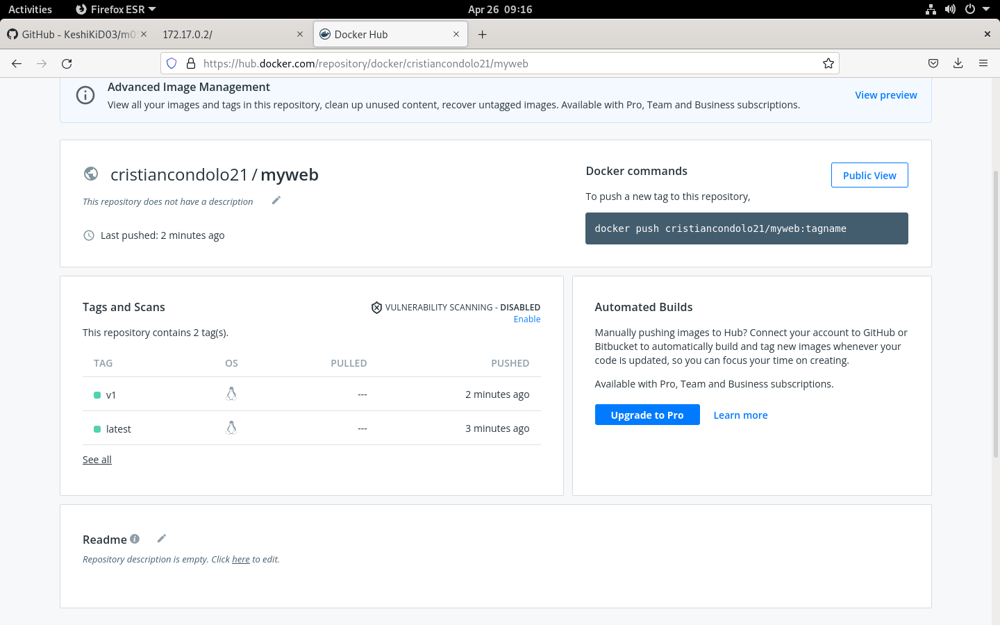
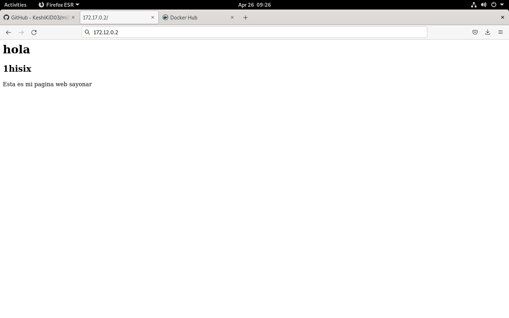
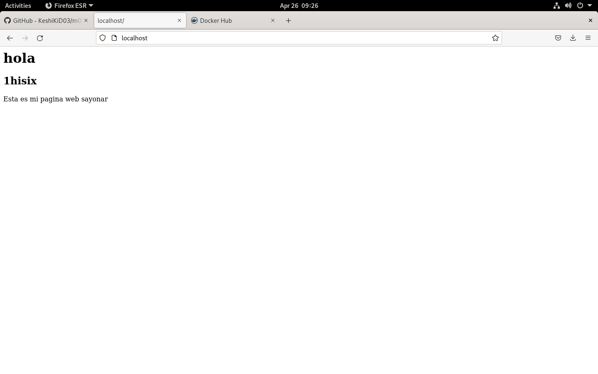
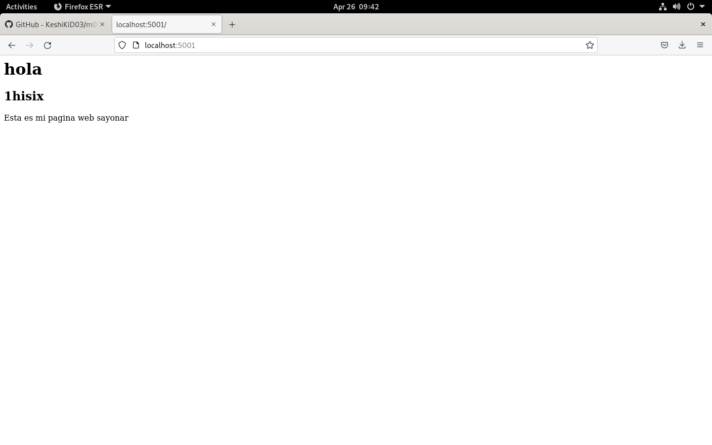

# Docker
Encender un fedora 27, poden trabajar dentro y que se llame `f27`:
---
> docker run --name f27 -h f27 -it fedora:27 /bin/bash

-   --name : nombre del docker/container
-   -h : hostname del docker/container
-    --it : terminal interactiva
-    /bin/bash : poder trabajar interativamente

Comprobar que es un fedora 27:
> cat /etc/os-release

Instalar paquetes de ip y ps ax:
> yum install iproute iputils procps

**fuera del docker**
> ip a
```asciidoc
3: docker0: <BROADCAST,MULTICAST,UP,LOWER_UP> mtu 1500 qdisc noqueue state UP group default 
    link/ether 02:42:20:95:6c:d4 brd ff:ff:ff:ff:ff:ff
    inet 172.17.0.1/16 brd 172.17.255.255 scope global docker0
       valid_lft forever preferred_lft forever
    inet6 fe80::42:20ff:fe95:6cd4/64 scope link 
       valid_lft forever preferred_lft forever
```

***[ Dentro del docker ]***

**Comprobar:**
- conectividad a si mismo
> ping 172.17.0.2

- conectividad con Broadcast
> ping 172.17.0.1

- conectividad a Internet
> ping 1.1.1.1

- conectividad a EDT
> ping www.escoladeltreball.org

Hay conectividad tanto de dentro como de afuera.

Encender un debian, de ultima version, y trabajar a dentro:
---
> docker run --name deb1 -h deb1 -it debian:latest /bin/bash

Instalar los mismos paquetes, pero para debian
> apt update

> apt install iproute2 iputils-ping procps

**Comprobar:**
- ping de uno mismo y del otro docker
> ping 172.12.0.3

> ping 172.12.0.2

***[ Fuera del docker ]***

```
docker top f27
docker top deb1
```

#### inspeccionar dockers
```
docker inspect f27 | less
```
info docker en formato json

#### lista redes por defecto
```
docker network ls
```

#### examinar cont red bridge
```
docker inspect bridge | less
```

### volver docker f27:
#### instalar un servidor web
```
yum install httpd
```

#### encender servidor web
```
vi /etc/www/html/index.html
```
```
<h1>hola</h1>
<h2>1hisix</h2>
Esta es mi pagina web
sayonar
```
````
/sbin/httpd
ps ax
````
````
dnf install nmap
````
````
nmap localhost
````
```

Starting Nmap 7.60 ( https://nmap.org ) at 2022-04-26 06:57 UTC
Nmap scan report for localhost (127.0.0.1)
Host is up (0.000013s latency).
Other addresses for localhost (not scanned): ::1
Not shown: 999 closed ports
PORT   STATE SERVICE
80/tcp open  http

Nmap done: 1 IP address (1 host up) scanned in 1.66 seconds
```

### fuera del docker:
````
nmap 172.17.0.2
````
```
telnet 172.17.0.2 80
GET / HTTP/1.0
[y dos Enters]

HTTP/1.1 200 OK
Date: Tue, 26 Apr 2022 06:59:01 GMT
Server: Apache/2.4.34 (Fedora)
Last-Modified: Tue, 26 Apr 2022 06:55:17 GMT
ETag: "3c-5dd892cf26247"
Accept-Ranges: bytes
Content-Length: 60
Connection: close
Content-Type: text/html; charset=UTF-8

<h1>hola</h1>
<h2>1hisix</h2>
Esta es mi pagina web
sayonar
Connection closed by foreign host.
```
```
wget 172.17.0.2
ls
```
```
index.html
```

### en un navegador
172.17.0.2
<center></img></center>

## generar una imatge, fuera del docker
```
docker commit -m "aserver web" f27 myweb
```
-    -m : descripcion

```
docker images
```

**mejor tenerlo guardado en tu repositorio docker (DockerHub)**
```
docker history myweb
```
```
IMAGE          CREATED              CREATED BY                                      SIZE      COMMENT
90206ae967fb   About a minute ago   /bin/bash                                       242MB     server web
f89698585456   3 years ago          /bin/sh -c #(nop) ADD file:1307fb57471f2c791…   236MB     
<missing>      3 years ago          /bin/sh -c #(nop)  ENV DISTTAG=f27container …   0B        
<missing>      3 years ago          /bin/sh -c #(nop)  MAINTAINER [Adam Miller <…   0B        
```

#### iniciar sesion de 
```
docker login
```

**para poder subir una imagen a nuestro repositorio**

[nom_usuario]/[nom_imagen]:[tag]

```
docker tag myweb:latest cristiancondolo21/myweb
docker images
```

#### eliminar el primero
```
docker rmi myweb:latest
```
```
docker push cristiancondolo21/myweb:latest
docker push cristiancondolo21/myweb:v1
```
<center></img></center>

> Problema: apagamos el docker f27 pero aun no esta destruido

#### ver los container en marcha
```
docker container ls
docker rm f27
```

## encender nuestro docker f27 (myweb)
```
docker run --rm --name f27 -h f27 -it cristiancondolo21/myweb: /bin/bash
```
    --rm : destruir docker una vez salgamos del docker

#### activar servidor web
```
/sbin/httpd
ps ax
```

### en un navegador
172.17.0.2

<center></img></center>

> Warning: este podria no a ver sido esta ip

#### para ver ip, dentro del docker (ip a) o fuera del docker (docker inspect bridge)

#### propagar docker por puerto 80
```
docker run --rm --name f27 -h f27 -p 80:80 -it cristiancondolo21/myweb:latest /bin/bash
```
-    -p [puerto_local]:[puerto:docker]

### en un navegador
localhost

http://j03:172.17.0.2:80/

### fuera del docker
```
mkdir myweb21
cd myweb
```

```
mkdir myweb21:base
cd myweb21:base
```

#### crear un Dockerfile
```dockerfile
# Web Server Exemple hisix1
FROM fedora:27
LABEL subject="webserver"
LABEL author="@cristiancondolo ASIX M01"
RUN dnf -y install procps iputils iproute nmap httpd
RUN mkdir /opt/docker
COPY * /opt/docker/
RUN chmod +x /opt/docker/startup.sh
WORKDIR /opt/docker
CMD /opt/docker/startup.sh
EXPOSE 80
```

```
docker run --rm --name f27 -h f27 -p 5001:80 -it cristiancondolo21/myweb:latest /bin/bash
/sbin/httpd
```
### en navegador:
localhost:5001

<center></img></center>

#### crear index.html y startup.sh
```
vim index.html
```
```
hola soc la pagina web
```
```
vim startup.sh
```
```
#!/bin/bash

cp /opt/docker/index.html /var/www/html
/sbin/httpd
```

```
docker build -t cristiancondolo21/myweb:v1 .
```
-    -t : tag del docker

```
docker images
```
```
REPOSITORY                TAG       IMAGE ID       CREATED              SIZE
cristiancondolo21/myweb   v1        1eb180a70aee   About a minute ago   478MB
cristiancondolo21/myweb   v2        1eb180a70aee   About a minute ago   478MB
cristiancondolo21/myweb   latest    90206ae967fb   42 minutes ago       478MB
debian                    latest    a11311205db1   6 days ago           124MB
fedora                    latest    b78af7a83692   4 months ago         153MB
hello-world               latest    feb5d9fea6a5   7 months ago         13.3kB
fedora                    32        c451de0d2441   12 months ago        202MB
fedora                    27        f89698585456   3 years ago          236MB
```
````
docker run --rm --name f27 -h f27 -p 5001:80 -it cristiancondolo21/myweb:v2 /bin/bash
bash startup.sh
````

### en un navegador:
localhost:5001
<center></img></center>
